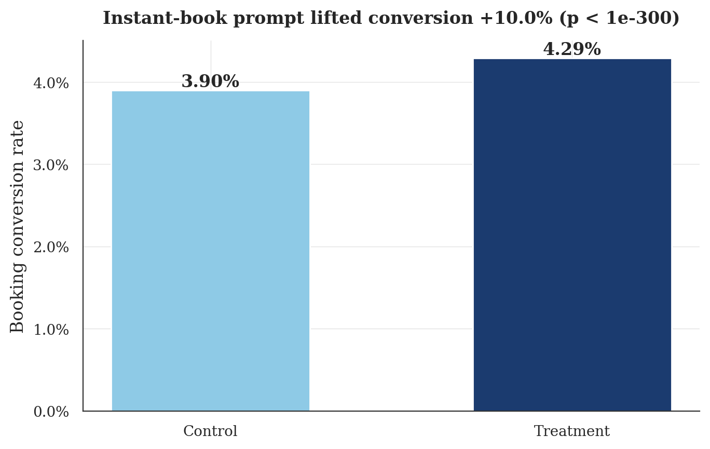
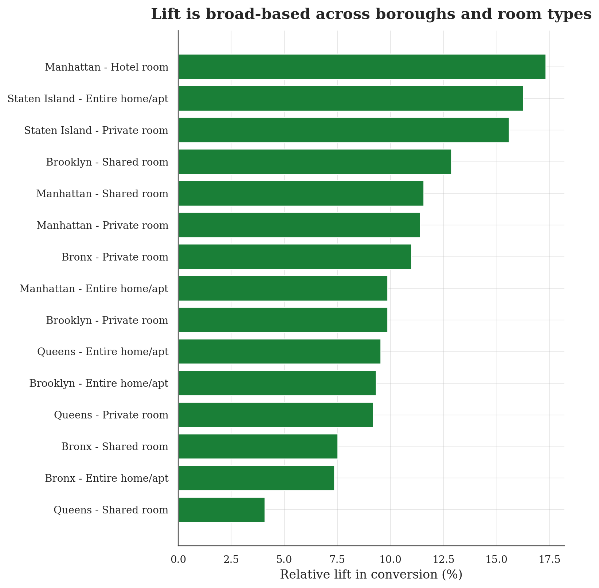

# One Prompt, 100,000 Listings: An Airbnb A/B Test

Would a "book instantly, no host approval needed" prompt get more people to
book? This analysis uses an A/B testing schema using the following: real data, a simulated experiment, SQL readouts,
statistics, and a dashboard.

The data is ~102k real NYC listings from
[Kaggle's Airbnb Open Data](https://www.kaggle.com/datasets/arianazmoudeh/airbnbopendata).
The experiment on top of it is simulated. A  known +10% lift was baked into the simulated bookings, which means the analysis has
a right answer. If the measurement is accurate, it should find +10% (as it does).

## How the experiment works

| Design choice | Value |
|---|---|
| Unit of randomization | Listing (salted hash of listing id, like real experiment platforms) |
| Split | 50 / 50 |
| Primary metric | Booking conversion rate (bookings / page views) |
| Secondary metric | Revenue per page view |
| Duration | 28 simulated days |
| Ground-truth effect | +10% relative lift on conversion odds |

Traffic follows listing popularity (Poisson on reviews per month) and
baseline conversion depends on rating and price, so the two groups are messy
in realistic ways rather than uniform.

## What the test found

| Metric | Control | Treatment | Lift |
|---|---|---|---|
| Conversion rate | 3.90% | 4.29% | **+10.0%** (p < 1e-300) |
| Revenue / view | $22.72 | $24.85 | +9.4% |

The 95% confidence interval on the relative lift is [+9.7%, +10.4%], right
on top of the true +10%.



Every borough and room type moved in the same direction, which is ideal:



Health check: the observed split came out 50.03% / 49.97%. The sample-ratio
mismatch chi-square test passes easily (0.03 against a 3.84 threshold), so
the randomization is trustworthy.

## The dashboard

`make dashboard` opens a two-tab Streamlit app: one tab tours the NYC market
as a whole (prices, boroughs, room types), the other walks through the
experiment readout with an interactive segment explorer.

The Airbnb name and logo are trademarks of Airbnb, Inc., used here only to
give this personal analysis project some visual context.

## Project structure

```
├── data/                    # raw Kaggle CSV (zipped)
├── src/
│   ├── clean_data.py        # 1. clean raw CSV -> SQLite (listings table)
│   ├── simulate_experiment.py # 2. hash-based 50/50 assignment + simulated outcomes
│   └── run_analysis.py      # 3. run SQL readout, z-test, CI, charts
├── sql/
│   ├── 01_group_summary.sql # headline metrics per group
│   ├── 02_lift.sql          # absolute + relative lift (CTE pivot)
│   ├── 03_segment_breakdown.sql # lift by borough x room type
│   └── 04_srm_check.sql     # sample-ratio-mismatch health check
├── dashboard/
│   └── app.py               # Streamlit dashboard (market + experiment tabs)
└── outputs/                 # readout CSVs, significance.json, charts
```

## Run it yourself

```bash
pip install -r requirements.txt
make all          # clean -> simulate -> analyze
make dashboard    # launch the Streamlit app
```

Everything is seeded, so a fresh clone lands on the exact numbers above.

## Methodology notes

- **Hash-based assignment**: `md5(experiment_name + listing_id)` decides the
  group.
- **Two-proportion z-test**: pooled standard error for the hypothesis test,
  unpooled for the confidence interval on the lift.
- **SRM check is priority**: if the observed split drifts from the designed
  50/50 beyond chance, nothing else in the readout should be trusted.
- **Segment cuts are directional**: the test is powered for the topline, so
  borough x room-type slices hover around the true effect (4-17% in the
  segment chart, all around the true +10%). That spread is a concrete
  picture of segment-level noise.
